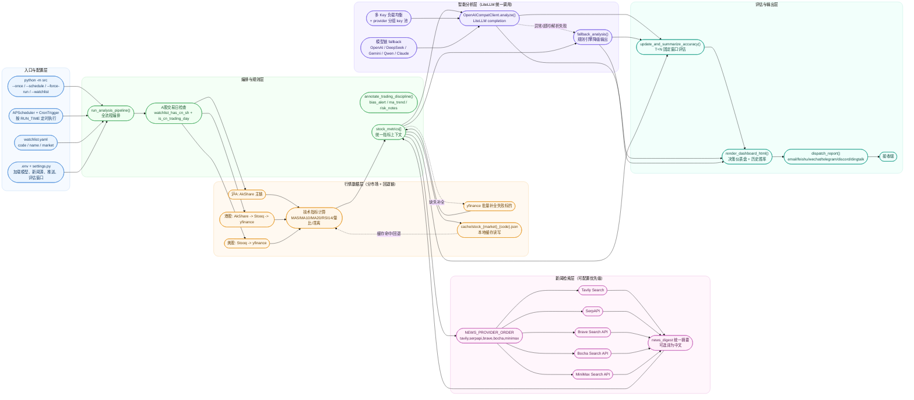

# GlobalBrain 系统架构图

```mermaid
%%{init: {"theme":"base","themeVariables":{"fontSize":"16px"}}}%%
flowchart LR
    %% =========================
    %% 1) 入口与配置层
    %% =========================
    subgraph S1["入口与配置层"]
        CLI(["python -m src<br/>--once / --schedule / --force-run / --watchlist"])
        SCH(["APScheduler + CronTrigger<br/>按 RUN_TIME 定时执行"])
        WLIST(["watchlist.yaml<br/>code / name / market"])
        CFG([".env + settings.py<br/>加载模型、新闻源、推送、评估窗口"])
    end

    %% =========================
    %% 2) 编排与规则层
    %% =========================
    subgraph S2["编排与规则层"]
        PIPE(["run_analysis_pipeline()<br/>全流程编排"])
        CAL(["A股交易日检查<br/>watchlist_has_cn_sh + is_cn_trading_day"])
        RULE(["annotate_trading_discipline()<br/>bias_alert / ma_trend / risk_notes"])
        AGG(["stock_metrics[]<br/>统一指标上下文"])
    end

    %% =========================
    %% 3) 行情数据层（分市场）
    %% =========================
    subgraph S3["行情数据层（分市场 + 回退链）"]
        CN(["沪A: AkShare 主链"])
        HK(["港股: AkShare -> Stooq -> yfinance"])
        US(["美股: Stooq -> yfinance"])
        BATCH(["yfinance 批量补全失败标的"])
        CACHE(["cache/stock_{market}_{code}.json<br/>本地缓存读写"])
        IND(["技术指标计算<br/>MA5/MA10/MA20/RSI14/量比/乖离"])
    end

    %% =========================
    %% 4) 新闻检索层（多 Provider）
    %% =========================
    subgraph S4["新闻检索层（可配置优先级）"]
        NEWS_ORDER(["NEWS_PROVIDER_ORDER<br/>tavily,serpapi,brave,bocha,minimax"])
        TAV(["Tavily Search"])
        SERP(["SerpAPI"])
        BRV(["Brave Search API"])
        BOC(["Bocha Search API"])
        MINI(["MiniMax Search API"])
        DIGEST(["news_digest 统一摘要<br/>可选译为中文"])
    end

    %% =========================
    %% 5) 智能分析层（LiteLLM）
    %% =========================
    subgraph S5["智能分析层（LiteLLM 统一调用）"]
        LLM(["OpenAICompatClient.analyze()<br/>LiteLLM completion"])
        KEYPOOL(["多 Key 负载均衡<br/>+ provider 分组 key 池"])
        MODELS(["模型链 fallback<br/>OpenAI / DeepSeek / Gemini / Qwen / Claude"])
        FB(["fallback_analysis()<br/>规则引擎降级输出"])
    end

    %% =========================
    %% 6) 评估与输出层
    %% =========================
    subgraph S6["评估与输出层"]
        ACC(["update_and_summarize_accuracy()<br/>T+N 固定窗口评估"])
        DASH(["render_dashboard_html()<br/>决策仪表盘 + 历史胜率"])
        PUSH(["dispatch_report()<br/>email/feishu/wechat/telegram/discord/dingtalk"])
        USER(["接收端"])
    end

    %% ===== 主流程连线 =====
    CLI --> PIPE
    SCH --> PIPE
    WLIST --> PIPE
    CFG --> PIPE
    PIPE --> CAL
    CAL --> CN
    CAL --> HK
    CAL --> US

    CN --> IND
    HK --> IND
    US --> IND
    IND --> AGG
    AGG --> CACHE
    CACHE -.缓存命中/回退.-> IND
    AGG -.缺失补全.-> BATCH --> AGG

    AGG --> NEWS_ORDER
    NEWS_ORDER --> TAV --> DIGEST
    NEWS_ORDER --> SERP --> DIGEST
    NEWS_ORDER --> BRV --> DIGEST
    NEWS_ORDER --> BOC --> DIGEST
    NEWS_ORDER --> MINI --> DIGEST
    DIGEST --> AGG

    AGG --> LLM
    KEYPOOL --> LLM
    MODELS --> LLM
    LLM -.异常/超时/解析失败.-> FB
    AGG --> FB

    LLM --> ACC
    FB --> ACC
    AGG --> ACC
    ACC --> DASH
    LLM --> DASH
    FB --> DASH
    DASH --> PUSH --> USER

    %% ===== 颜色与圆角（多子图多配色） =====
    classDef cEntry fill:#EAF4FF,stroke:#4C8EDA,color:#163B63,stroke-width:1.4px,rx:18,ry:18;
    classDef cOrch fill:#EFFFF1,stroke:#4BAE66,color:#1A5730,stroke-width:1.4px,rx:18,ry:18;
    classDef cData fill:#FFF6E9,stroke:#E79A2A,color:#6A4205,stroke-width:1.4px,rx:18,ry:18;
    classDef cNews fill:#FFF0FA,stroke:#C763B8,color:#5B1F52,stroke-width:1.4px,rx:18,ry:18;
    classDef cAI fill:#F1EEFF,stroke:#7C66E6,color:#31246E,stroke-width:1.4px,rx:18,ry:18;
    classDef cOut fill:#EFFFFB,stroke:#1FA08B,color:#0E4C42,stroke-width:1.4px,rx:18,ry:18;

    class CLI,SCH,WLIST,CFG cEntry;
    class PIPE,CAL,RULE,AGG cOrch;
    class CN,HK,US,BATCH,CACHE,IND cData;
    class NEWS_ORDER,TAV,SERP,BRV,BOC,MINI,DIGEST cNews;
    class LLM,KEYPOOL,MODELS,FB cAI;
    class ACC,DASH,PUSH,USER cOut;

    style S1 fill:#F6FAFF,stroke:#BFD9F7,stroke-width:1.2px,rx:20,ry:20
    style S2 fill:#F4FFF6,stroke:#BEEBC8,stroke-width:1.2px,rx:20,ry:20
    style S3 fill:#FFF9F1,stroke:#F6D3A1,stroke-width:1.2px,rx:20,ry:20
    style S4 fill:#FFF6FC,stroke:#EAB7DF,stroke-width:1.2px,rx:20,ry:20
    style S5 fill:#F6F3FF,stroke:#CFC5FF,stroke-width:1.2px,rx:20,ry:20
    style S6 fill:#F2FFFB,stroke:#BDEDE2,stroke-width:1.2px,rx:20,ry:20
```

## 说明

- 本项目以 `run_analysis_pipeline()` 为中心，将行情、新闻、LLM、评估、推送串成单条可降级链路。
- 数据与模型层均是“多源 + 回退”设计，目标是优先保证每日报告可产出。
- 新闻与模型都支持“优先级 / key 池 / fallback”策略，适合长期自动化运行场景。
