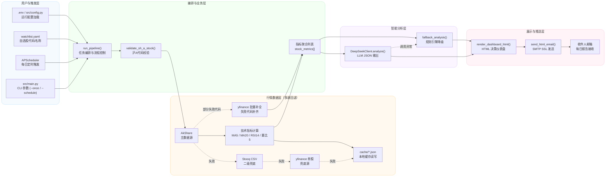

# GlobalBrain 系统架构图

## 说明

- 主入口由 `src/main.py` 驱动：支持立即执行和定时任务两种模式。
- 行情获取以 `AkShare` 为主，失败后按 `Stooq -> yfinance -> 本地缓存` 回退，并在末尾对失败股票做 `yfinance` 批量补齐。
- 分析优先走 `DeepSeek`，异常时自动切换 `fallback_analysis()` 规则引擎，保证可用性。
- 输出统一汇总到 HTML 仪表盘，再通过 SMTP 推送至收件人邮箱。
