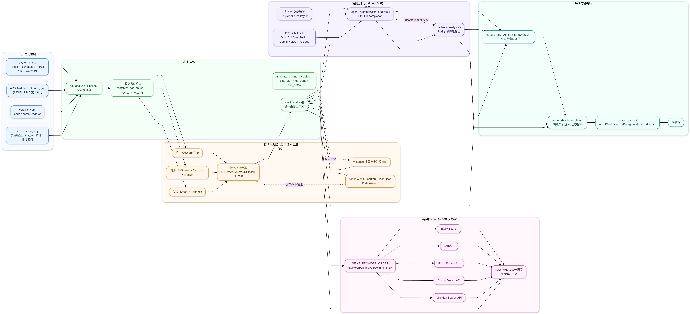

# GlobalBrain

自选股智能分析系统

基于 Python + DeepSeek 大模型，每日自动分析沪A股自选股并邮件推送「决策仪表盘」。

## 系统架构图



- 主入口由 `main.py` 驱动：支持立即执行和定时任务两种模式。
- 行情获取以 `AkShare` 为主，失败后按 `Stooq -> yfinance -> 本地缓存` 回退，并在末尾对失败股票做 `yfinance` 批量补齐。
- 分析优先走 `DeepSeek`，异常时自动切换 `fallback_analysis()` 规则引擎，保证可用性。
- 输出统一汇总到 HTML 仪表盘，再通过 SMTP 推送至收件人邮箱。

## 功能

- 支持沪A股代码校验（如 `600xxx`、`601xxx`、`688xxx`）
- 使用 `akshare` 获取日线行情
- 计算 MA5 / MA20 / RSI14 / 量比(5)
- 调用 DeepSeek 输出个股建议（买入/观察/减仓）
- 失败自动降级到规则引擎
- 通过 SMTP 推送 HTML 决策仪表盘到邮箱
- 支持每日定时自动执行

## 快速开始

1. 安装依赖

```bash
pip install -r requirements.txt
```

2. 配置环境变量

```bash
copy .env.example .env
```

编辑 `.env`：

- `DEEPSEEK_API_KEY`: DeepSeek API Key
- `SMTP_*`: 邮箱服务器配置（建议使用授权码）
- `MAIL_TO`: 多个收件人使用英文逗号分隔
- `RUN_TIME`: 每日执行时间，格式 `HH:MM`

3. 配置自选股

编辑 `watchlist.yaml`，仅填写沪A股六位代码：

```yaml
watchlist:
  - "600519"
  - "601318"
  - "688981"
```

4. 运行

立即执行一次：

```bash
python main.py --once
```

每日定时执行（默认）：

```bash
python main.py --schedule
```

## 建议部署

- Windows 任务计划程序：开机启动 `python main.py --schedule`
- 或 Linux `systemd` / `supervisor` 守护进程
- 建议在交易日收盘后时间触发（如 `22:00`）

## 免责声明

本项目仅限学习与研究用途，不构成任何投资建议。股市投资存在风险，入市请务必谨慎。作者对因使用本项目所引发的任何损失不承担责任。
