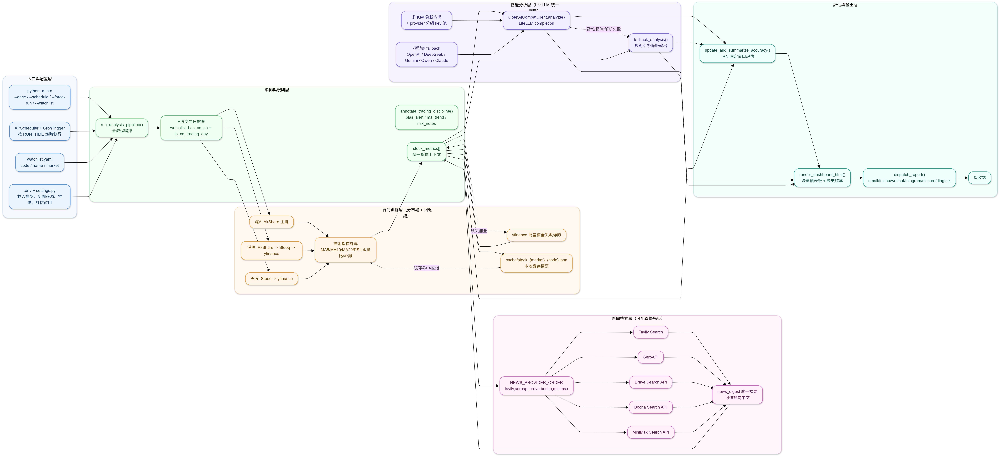

# GlobalBrain


股票智能分析系統（滬A / 港股 / 美股）。

每天自動拉取自選股行情、生成策略建議、彙總新聞摘要、輸出 HTML 決策儀表板並推送通知。

## 最小可運行配置（複製即用）

將以下內容寫入 `.env`（按你的實際帳號替換）：

```env
OPENAI_API_KEY=your_api_key
OPENAI_BASE_URL=https://api.deepseek.com
OPENAI_MODEL=deepseek-chat
NOTIFY_CHANNELS=email
SMTP_HOST=smtp.qq.com
SMTP_PORT=465
SMTP_USER=your_email@qq.com
SMTP_PASSWORD=your_smtp_auth_code
MAIL_FROM=your_email@qq.com
MAIL_TO=receiver@example.com
```

## 系統架構圖



**說明**

- 本專案以 `run_analysis_pipeline()` 為中心，將行情、新聞、LLM、評估、推送串成單條可降級鏈路。
- 資料與模型層均是「多源 + 回退」設計，目標是優先保證每日報告可產出。
- 新聞與模型都支援「優先級 / key 池 / fallback」策略，適合長期自動化運行場景。

## 核心能力

- **多市場支援**：`cn_sh`（滬A）、`hk`（港股）、`us`（美股）
- **行情多源回退**：
  - 滬A：AkShare 主鏈，失敗回退 Stooq / yfinance / 本地快取
  - 港股：AkShare -> Stooq -> yfinance
  - 美股：Stooq -> yfinance
- **LLM 統一接入 LiteLLM**：
  - 支援 OpenAI 相容、DeepSeek、Claude、Gemini、通義千問等
  - 支援多模型 fallback、多 API Key 負載均衡
  - 支援按 provider 分組 key 池（避免不同廠商 key 混用）
- **新聞多源檢索**：
  - Tavily、SerpAPI、Brave、Bocha、MiniMax
  - 可按優先級自動降級
- **策略輸出與降級**：
  - LLM 正常時輸出結構化建議（買入/觀察/減倉）
  - 模型異常自動降級 `fallback_analysis`
- **歷史準確率評估**：
  - 自動記錄建議並回測
  - 支援固定窗口（如 `T+1/T+3/T+5`，可透過 `.env` 自訂）
  - 輸出方向勝率、止盈命中率、止損命中率
- **通知與展示**：
  - HTML 決策儀表板
  - 支援 `email / feishu / wechat / telegram / discord / dingtalk`

## 快速開始

### 1) 安裝依賴

```bash
pip install -r requirements.txt
```

### 2) 配置環境變數

```bash
copy .env.example .env
```

至少配置以下關鍵項目：

- `OPENAI_API_KEY` 或 `DEEPSEEK_API_KEY`（建議使用 `LLM_API_KEYS`）
- `OPENAI_MODEL`（或 `LLM_MODEL`）
- `SMTP_*` 與 `MAIL_TO`（若使用郵件推送）
- `RUN_TIME`（定時執行時間）

### 3) 配置自選股

`watchlist.yaml` 範例：

```yaml
watchlist:
  - code: "600519"
    name: "貴州茅台"
    market: cn_sh
  - code: "00700"
    name: "騰訊控股"
    market: hk
  - code: "AAPL"
    name: "Apple"
    market: us
```

說明：

- 滬A：6 位數字（如 `600519`）
- 港股：建議 5 位數字字串（如 `00700`）
- 美股：ticker（如 `AAPL`、`BRK-B`）

### 4) 執行

立即執行一次：

```bash
python -m src --once
```

定時執行：

```bash
python -m src --schedule
```

常用參數：

- `--watchlist <path>`：指定自選股檔案路徑
- `--force-run`：跳過交易日檢查（非交易日也執行）

## 推送效果


## 關鍵配置說明（.env）

### LLM（LiteLLM 統一呼叫）

- `OPENAI_MODEL` / `LLM_FALLBACK_MODELS`：主模型與回退模型鏈
- `LLM_API_KEYS`：通用多 key（逗號分隔）
- provider 分組 key 池（可選）：
  - `OPENAI_API_KEYS`
  - `ANTHROPIC_API_KEYS`
  - `GEMINI_API_KEYS`
  - `QWEN_API_KEYS`
  - `DEEPSEEK_API_KEYS`

### 新聞檢索

- `NEWS_PROVIDER_ORDER=tavily,serpapi,brave,bocha,minimax`
- 對應 key：
  - `TAVILY_API_KEY`
  - `SERPAPI_API_KEY`
  - `BRAVE_API_KEY`
  - `BOCHA_API_KEY`
  - `MINIMAX_API_KEY`

### 準確率評估

- `ACCURACY_WINDOWS=1,3,5`
  - 按固定交易日窗口評估，避免「持有越久越容易命中」的偏差

## 專案入口

- Python 模組入口：`python -m src`
- 運行邏輯入口：`src/app/main.py`

## 建議部署

- Windows：工作排程器執行 `python -m src --schedule`
- Linux：`systemd` / `supervisor` 常駐
- 建議收盤後執行（並根據市場時區調整 `TIMEZONE` 與 `RUN_TIME`）

## License

- MIT License

- Copyright (c) 2026 楊友三

## 聯繫與合作

- Email：yangyousan@hotmail.com

## 免責聲明

本專案僅限學習與研究用途，不構成任何投資建議。股市投資存在風險，入市請務必謹慎。作者對因使用本專案所引發的任何損失不承擔責任。