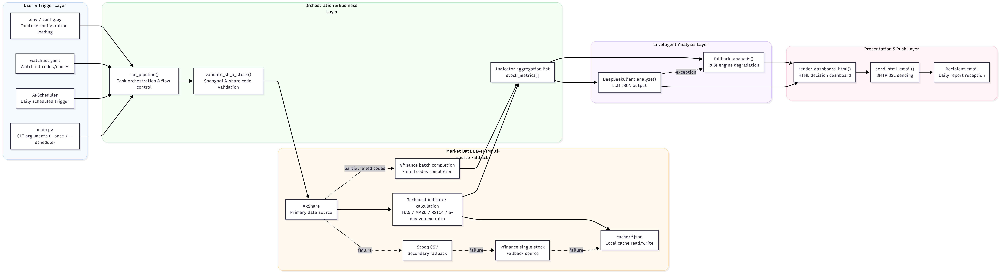

# GlobalBrain

Intelligent Stock Analysis System for Selected Stocks

A Python + DeepSeek large language model based system that automatically analyzes selected Shanghai A-shares daily and delivers a "decision dashboard" via email.

## System Architecture Diagram



- The main entry point is driven by `main.py`, supporting both immediate execution and scheduled task modes.
- Market data retrieval primarily uses `AkShare`, with fallbacks to `Stooq -> yfinance -> local cache` upon failure. Failed stocks are batch-retrieved using `yfinance` at the end.
- Analysis prioritizes `DeepSeek`, automatically switching to the `fallback_analysis()` rule engine in case of exceptions to ensure availability.
- Outputs are consolidated into an HTML dashboard and sent to recipients via SMTP.

## Features

- Supports validation of Shanghai A-share stock codes (e.g., `600xxx`, `601xxx`, `688xxx`)
- Uses `akshare` to fetch daily market data
- Calculates MA5 / MA20 / RSI14 / volume ratio (5)
- Calls DeepSeek to provide stock-specific recommendations (buy / hold / reduce)
- Automatically downgrades to rule engine upon failure
- Sends HTML decision dashboard to email via SMTP
- Supports scheduled daily automatic execution

## Quick Start

1. Install dependencies

```bash
pip install -r requirements.txt
```

2. Configure environment variables

```bash
copy .env.example .env
```

Edit `.env`:

- `DEEPSEEK_API_KEY`: DeepSeek API Key
- `SMTP_*`: Email server configuration (it is recommended to use an authorization code)
- `MAIL_TO`: Separate multiple recipients with commas
- `RUN_TIME`: Daily execution time in `HH:MM` format

3. Configure your watchlist

Edit `watchlist.yaml`, entering only the six-digit codes of Shanghai A-shares:

```yaml
watchlist:
  - "600519"
  - "601318"
  - "688981"
```

4. Run

Execute once immediately:

```bash
python main.py --once
```

Run on a daily schedule (default):

```bash
python main.py --schedule
```

## Recommended Deployment

- Windows Task Scheduler: start `python main.py --schedule` at boot
- Or use Linux `systemd` / `supervisor` as a daemon
- It is recommended to trigger execution after market close on trading days (e.g., `18:30`)

## Disclaimer

The output of this system is for research and decision support purposes only and does not constitute investment advice. Please exercise independent judgment based on your risk tolerance.