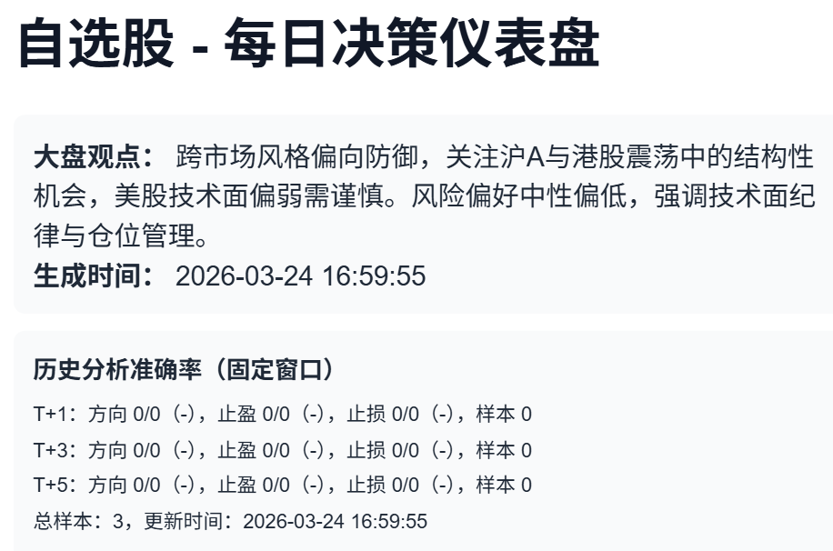
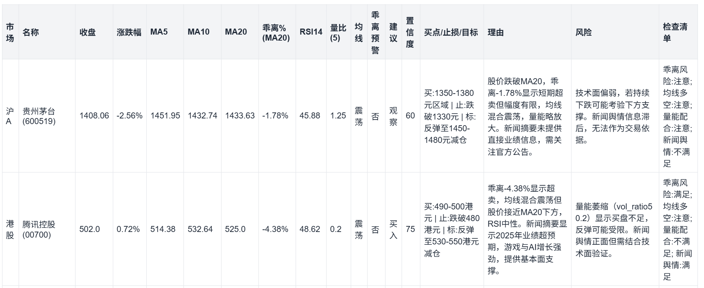
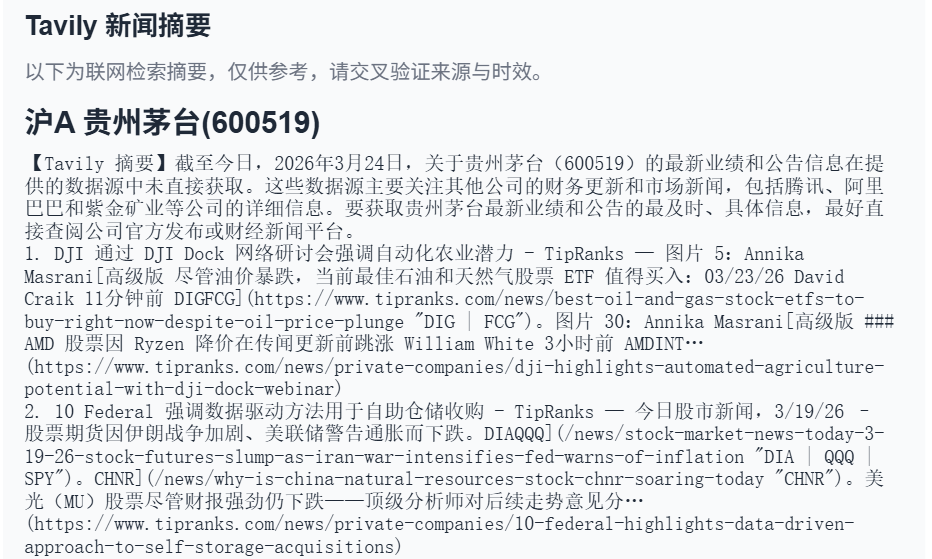

# GlobalBrain


Intelligent Stock Analysis System (Shanghai A-Shares / Hong Kong Stocks / US Stocks).

Automatically fetches market data for watchlist stocks, generates strategy suggestions, aggregates news summaries, outputs an HTML decision dashboard, and sends notifications daily.

## Minimal Runnable Configuration (Copy & Use)

Write the following content into `.env` (replace with your actual credentials):

```env
OPENAI_API_KEY=your_api_key
OPENAI_BASE_URL=https://api.deepseek.com
OPENAI_MODEL=deepseek-chat
NOTIFY_CHANNELS=email
SMTP_HOST=smtp.qq.com
SMTP_PORT=465
SMTP_USER=your_email@qq.com
SMTP_PASSWORD=your_smtp_auth_code
MAIL_FROM=your_email@qq.com
MAIL_TO=receiver@example.com
```

## System Architecture Diagram


**Description**

- This project centers around `run_analysis_pipeline()`, which orchestrates market data, news, LLM, evaluation, and push notifications into a single degradable chain.
- Both the data and model layers employ a "multi-source + fallback" design, prioritizing the reliable generation of daily reports.
- News retrieval and models support strategies like "priority / key pool / fallback", suitable for long-term automated operation.

## Core Capabilities

- **Multi-Market Support**: `cn_sh` (Shanghai A-Shares), `hk` (Hong Kong Stocks), `us` (US Stocks)
- **Multi-Source Fallback for Market Data**:
  - Shanghai A-Shares: Primary chain uses AkShare, falls back to Stooq / yfinance / local cache.
  - Hong Kong Stocks: AkShare -> Stooq -> yfinance
  - US Stocks: Stooq -> yfinance
- **Unified LLM Access via LiteLLM**:
  - Supports OpenAI-compatible, DeepSeek, Claude, Gemini, Qwen, etc.
  - Supports multi-model fallback and multi-API key load balancing.
  - Supports grouping key pools by provider (prevents mixing keys from different vendors).
- **Multi-Source News Retrieval**:
  - Tavily, SerpAPI, Brave, Bocha, MiniMax.
  - Automatic degradation based on priority order.
- **Strategy Output and Degradation**:
  - Under normal LLM operation, outputs structured suggestions (Buy / Hold / Reduce).
  - Automatically falls back to `fallback_analysis` if the model encounters issues.
- **Historical Accuracy Evaluation**:
  - Automatically records suggestions and performs backtesting.
  - Supports fixed windows (e.g., `T+1/T+3/T+5`, customizable via `.env`).
  - Outputs directional win rate, take-profit hit rate, and stop-loss hit rate.
- **Notifications and Display**:
  - Generates an HTML decision dashboard.
  - Supports `email / feishu / wechat / telegram / discord / dingtalk`.

## Quick Start

### 1) Install Dependencies

```bash
pip install -r requirements.txt
```

### 2) Configure Environment Variables

```bash
copy .env.example .env
```

Configure at least the following key items:

- `OPENAI_API_KEY` or `DEEPSEEK_API_KEY` (recommended to use `LLM_API_KEYS`)
- `OPENAI_MODEL` (or `LLM_MODEL`)
- `SMTP_*` and `MAIL_TO` (if using email push)
- `RUN_TIME` (scheduled execution time)

### 3) Configure Watchlist

Example `watchlist.yaml`:

```yaml
watchlist:
  - code: "600519"
    name: "Kweichow Moutai"
    market: cn_sh
  - code: "00700"
    name: "Tencent Holdings"
    market: hk
  - code: "AAPL"
    name: "Apple"
    market: us
```

Description:

- Shanghai A-Shares: 6-digit number (e.g., `600519`)
- Hong Kong Stocks: Recommended as a 5-digit string (e.g., `00700`)
- US Stocks: Ticker (e.g., `AAPL`, `BRK-B`)

### 4) Run

Execute once immediately:

```bash
python -m src --once
```

Run on a schedule:

```bash
python -m src --schedule
```

Common arguments:

- `--watchlist <path>`: Specify the watchlist file path
- `--force-run`: Skip trading day check (executes even on non-trading days)

## Push Notification Examples







## Key Configuration Details (.env)

### LLM (Unified LiteLLM Calls)

- `OPENAI_MODEL` / `LLM_FALLBACK_MODELS`: Primary model and fallback model chain.
- `LLM_API_KEYS`: General multi-key (comma-separated).
- Optional provider-specific key pools:
  - `OPENAI_API_KEYS`
  - `ANTHROPIC_API_KEYS`
  - `GEMINI_API_KEYS`
  - `QWEN_API_KEYS`
  - `DEEPSEEK_API_KEYS`

### News Retrieval

- `NEWS_PROVIDER_ORDER=tavily,serpapi,brave,bocha,minimax`
- Corresponding keys:
  - `TAVILY_API_KEY`
  - `SERPAPI_API_KEY`
  - `BRAVE_API_KEY`
  - `BOCHA_API_KEY`
  - `MINIMAX_API_KEY`

### Accuracy Evaluation

- `ACCURACY_WINDOWS=1,3,5`
  - Evaluates based on fixed trading day windows to avoid bias from longer holding periods appearing more successful.

## Project Entry Point

- Python module entry: `python -m src`
- Core logic entry: `src/app/main.py`

## Recommended Deployment

- Windows: Use Task Scheduler to execute `python -m src --schedule`
- Linux: Use `systemd` / `supervisor` to keep the process running.
- It is recommended to run after market close (adjust `TIMEZONE` and `RUN_TIME` based on market time zones).

## License

- MIT License
- Copyright (c) 2026 Yang Yousan

## Contact & Collaboration

- Email: yangyousan@hotmail.com

## Disclaimer

This project is intended for learning and research purposes only and does not constitute investment advice. Stock market investment involves risks; please exercise caution when entering the market. The author assumes no responsibility for any losses incurred through the use of this project.